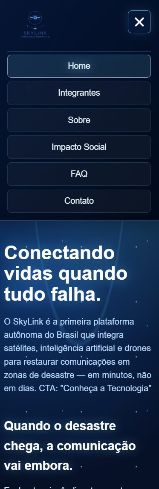
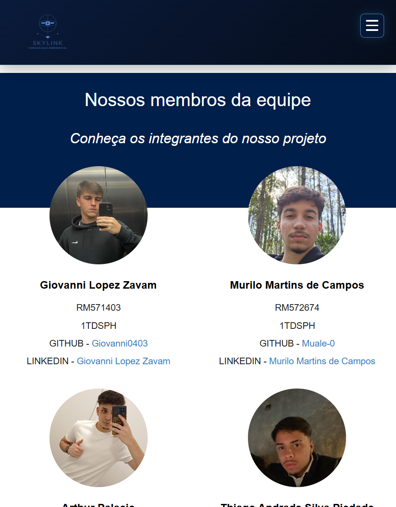
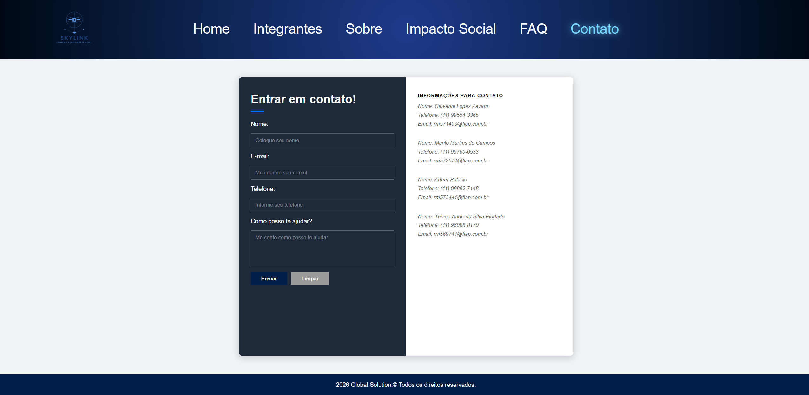

# Global Solution - SkyLink

## Descricao do Projeto

O SkyLink e um site desenvolvido para a Global Solution da disciplina de Front-End Design Engineering. A proposta apresenta uma solucao de comunicacao emergencial para regioes afetadas por desastres naturais, utilizando satelites, inteligencia artificial, drones VTOL, rede Mesh e energia solar para restaurar conexoes quando a infraestrutura terrestre falha.

O projeto foi criado com foco em estrutura semantica, navegacao entre paginas, responsividade para desktop, tablet e mobile, interatividade com JavaScript e organizacao dos arquivos em pastas separadas.

## Tecnologias Utilizadas

- HTML5
- CSS3
- JavaScript
- Media Queries
- Git e GitHub
- FormSubmit para envio de formulario

## Estrutura de Pastas

assets/
arthur.jpg
giovanni.jpg
logo.png
murilo.jpg
thiago.jpg

css/
base.css
contato.css
faq.css
impacto.css
index.css
integrantes.css
main.css
responsividade.css
sobre.css

js/
contato.js
index.js
faq.js
responsividade.js

paginas/
contato.html
faq.html
impacto.html
integrantes.html
sobre.html

index.html(na raiz)
README.md

## Imagens e Icones

As imagens utilizadas no projeto estao na pasta `assets/`:

- `logo.png` - logo do projeto SkyLink.
- `giovanni.jpg` - foto do integrante Giovanni.
- `murilo.jpg` - foto do integrante Murilo.
- `arthur.jpg` - foto do integrante Arthur.
- `thiago.jpg` - foto do integrante Thiago.

## imagens de funcionalidade

estao localizadas dentro do assets

## Repositorio

Link do repositorio no GitHub:

[https://github.com/Giovanni0403/Global-Solution.git](https://github.com/Giovanni0403/Global-Solution.git)

## Integrantes

### Giovanni Lopez Zavam

- RM: 571403
- Turma: 1TDSPH
- GitHub: <https://github.com/Giovanni0403>
- LinkedIn: <https://www.linkedin.com/in/giovanni-lopez-zavam>

### Murilo Martins de Campos

- RM: 572674
- Turma: 1TDSPH
- GitHub: <https://github.com/Muale-0>
- LinkedIn: <https://www.linkedin.com/in/murilo-martins-de-campos-573727410>

### Arthur Palacio

- RM: 573441
- Turma: 1TDSPH
- GitHub: <https://github.com/ruhtradev10>
- LinkedIn: <https://www.linkedin.com/in/arthur-palacio-alves-3911a13b3>

### Thiago Andrade Silva Piedade

- RM: 569741
- Turma: 1TDSPH
- GitHub: <https://github.com/Euthiaguera>
- LinkedIn: <https://www.linkedin.com/in/thiago-andrade-08b2b6321/>

## Contato

- Giovanni Lopez Zavam - rm571403@fiap.com.br
- Murilo Martins de Campos - rm572674@fiap.com.br
- Arthur Palacio - rm573441@fiap.com.br
- Thiago Andrade Silva Piedade - rm569741@fiap.com.br
